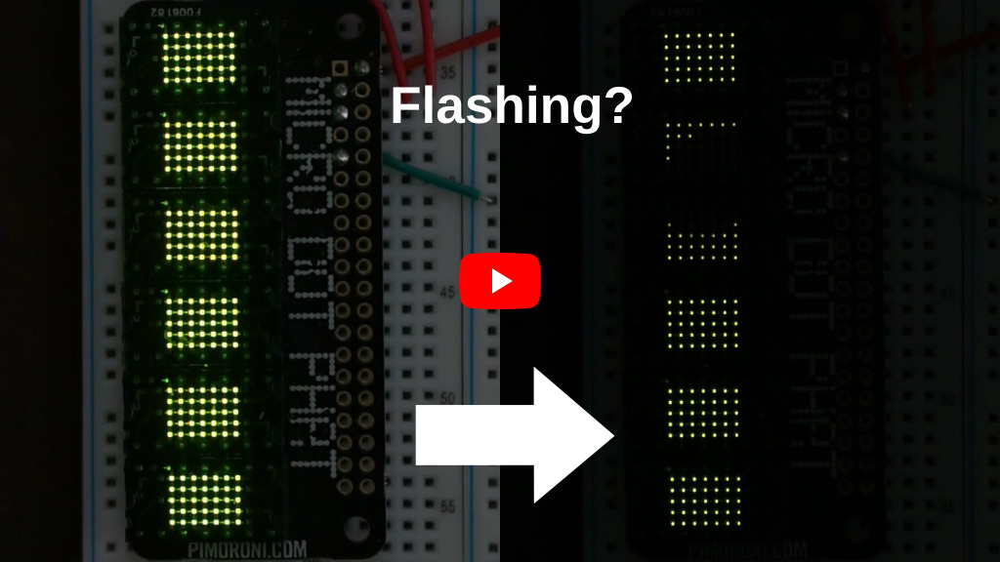
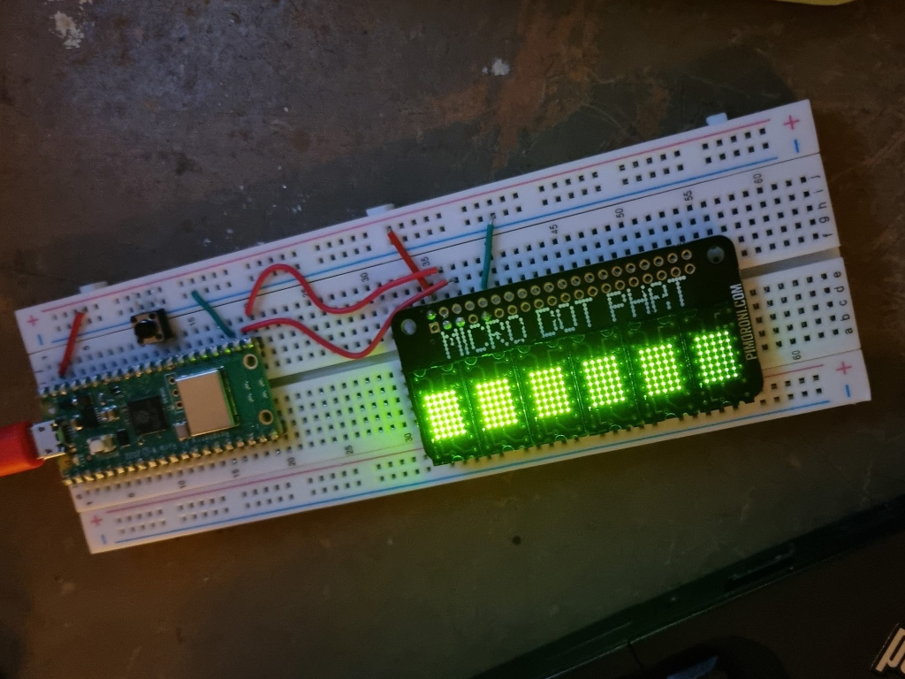

# microdot-pico #

This is an example of getting Pimoroni's [Micro Dot pHAT](https://shop.pimoroni.com/products/microdot-phat) working with a Raspberry Pi Pico with the C SDK. The Micro Dot pHAT has three IS31FL3730 modules, each controlling two LTP-305 LED matrices.

Video clip in action:

This is an evolution of an unpublished project of using the Micro Dot pHAT with a Teensy, so as an added bonus it's built on top of the [Adafruit-GFX-Library](https://github.com/adafruit/Adafruit-GFX-Library) library and an existing [IS31FL3730](https://github.com/jbkim/IS31FL3730) library. Rather than implement stubs for missing bits of the Arduino IDE, this time I've just stripped out/re-written the Arduino bits of code with Pico equivalents directly in the libraries as needed.

I've also borrowed some bits of code from my own [pico-composite-PAL-colour](https://github.com/guruthree/pico-composite-PAL-colour) for random numbers, time, and a plasma effect demo.

### Software shenanigans

Yes, I'm aware this is a derivative unholy abomination of Pi, Teensy, Arduino, and Pico. But on the plus side I've also implemented a rudimentary PWM brightness! There are 12 levels of brightness available, set as pixel values 0-12. Any more levels and the display starts flickering a lot. The number of brightness levels is controlled in `MicroMatrix.h` by changing the return value of `getBrightnessLevels()`.

The IS31FL3730 chips have some control over brightness via a brightness register and current register. These are set in `MicroMatrix::begin` in `MicroMatrix.cpp` to values that are not eye searingly bright. Please refer to the [IS31FL3730 datasheet](https://www.mouser.co.uk/datasheet/2/198/IS31FL3730_DS-1949579.pdf) for more detail.

There is also compensation for the gaps between LTP-305 modules, controlled in `MicroMatrix.h` by changing the value of `SEGMENTPADDING`. I've found a value of 3 best for things in motion, 4 for static images, and 0 if you want to use text.

### Hardware setup

The Micro Dot pHAT really only needs [4 connections](https://pinout.xyz/pinout/micro_dot_phat#).

* Pins 2 or 4 for +5V.
* Pins 3 and 5 for I2C SDA and SCL respectively.
* Pins 6, 9, 14, 20, 25, 30, 34, or 39 for ground.

I have connected to I2C0 on the Pico on pins 16 and 17, but these are easily changed by altering the `#define SDA_PIN`, `SCL_PIN`, or `I2C_BUS` at the top of `microdot-pico.cpp`.

I've been working with a Pico W, so if you're using a regular Pico (or other RP2040-based board) you will probably want to comment out or change the `PICO_BOARD` definition in `CMakeLists.txt`.

Note that I have the I2C bus running at **2.4 MHz**, which is a touch faster than recommended for the IS31FL3730. I don't think this can cause any harm, but as always, proceed at your own risk.

Here's the setup I've been running on my breadboard. It's getting dimmer left to right on purpose, see above describing the brightness effects.

### Usage

0. Have a working Raspberry Pi Pico C SDK setup.
1. Clone/download the repository.
2. Ensure that there is a symbolic link or copy of `pico_sdk_import.cmake` from the Pico C SDK in the root of the repository. `pico_extras_import.cmake` might also be needed.
3. Create a `build` directory, `cd` to it, and run `cmake ../`. (Or your build system equivalents.)
4. Build by running `make`. (Or your build system equivalent.)
5. Reset (or plug in) the Pico holding down the `BOOTSEL` and copy `microdot-pico.uf2` to the Pico's USB mass storage device.

